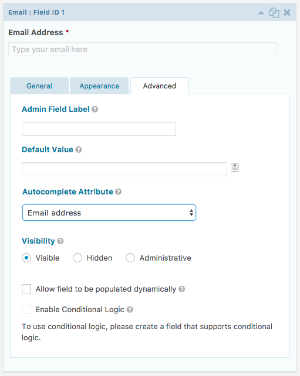

# Gravity Forms: Autocomplete Fields

[](https://travis-ci.org/growella/gravityforms-autocomplete-fields)
[](https://codeclimate.com/github/growella/gravityforms-autocomplete-fields)
[](https://codeclimate.com/github/growella/gravityforms-autocomplete-fields/coverage)

> **Note:** This plugin is still early in its development lifecycle, and it's not recommended for use in a production environment [until it hits its first release](https://github.com/growella/gravityforms-autocomplete-fields/releases).


The Gravity Forms: Autocomplete Fields adds support for [the HTML5 `autocomplete` attribute](https://developer.mozilla.org/en-US/docs/Web/HTML/Element/input#attr-autocomplete) to Gravity Forms' fields.

The `autocomplete` attribute is an HTML5 standard used to assist browsers auto-fill user data by disambiguating the form fields. By explicitly assigning these attributes to Gravity Forms fields, we can help improve the user experience when completing forms.

```html
<form>
	<!-- Hints that "fname" is the user's given (first) name -->
	<label for="first-name">First Name</label>
	<input name="fname" id="first-name" autocomplete="given-name" />

	<!-- Helps autocomplete the postal code -->
	<label for="zip">ZIP Code</label>
	<input name="zip" id="zip" autocomplete="postal-code" />
</form>
```

If the `autocomplete` property is new to you, [Cloud Four has a great writeup about use-cases and implementation](https://cloudfour.com/thinks/autofill-what-web-devs-should-know-but-dont/).


## Installation

To install this add-on, either clone or download a zip of the repository and add it to your WordPress installation's `wp-content/plugins/` folder. Once in-place, activate the plugin through the "Plugins" screen in the WordPress administration tool.

Please note that this plugin requires [Gravity Forms](http://www.gravityforms.com/) and PHP version 5.3 or higher.


## Usage

Upon activation, the plugin will add "Autocomplete Attribute" settings to every Gravity Forms field type, under the "Advanced" tab.



Selecting a value here will inject the corresponding `autocomplete` attribute when the form is rendered.